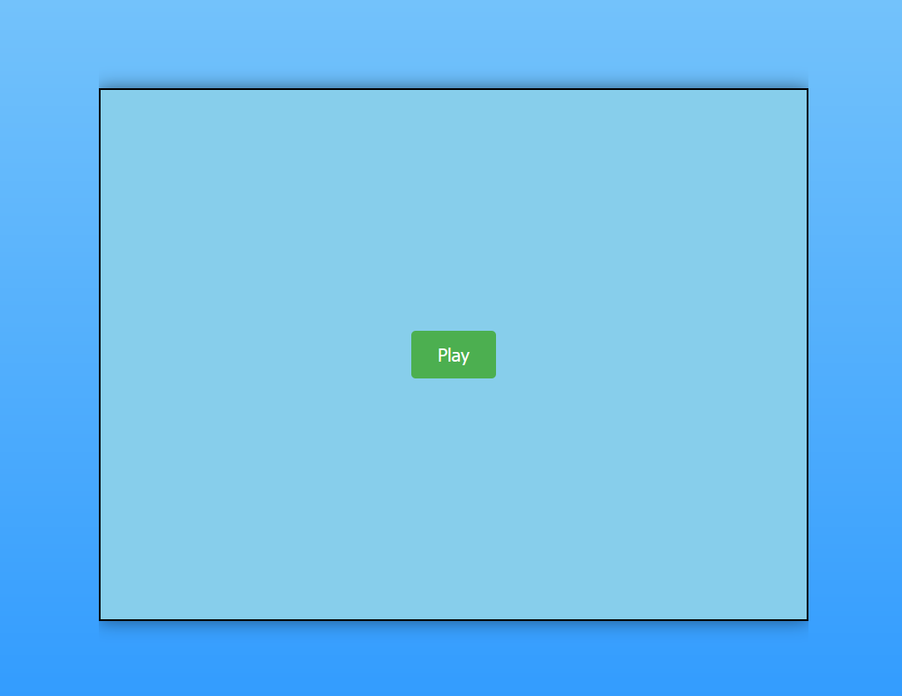
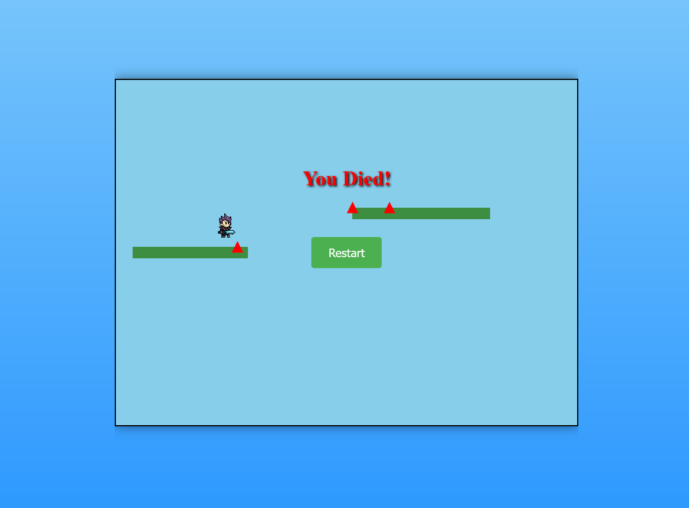

# **Infinite Platform Runner**

Game can be played at

https://glittering-maamoul-a5cbb5.netlify.app/




## Table of Contents

- [About the Game](#about-the-game)
- [Features](#features)
- [Gameplay](#gameplay)
  [Controls](#controls)
- [Installation](#installation)
- [Usage](#usage)
- [Technologies Used](#technologies-used)
- [Contributing](#contributing)
- [License](#license)
- [Contact](#contact)

## About the Game

**Infinite Runner Platformer** is a dynamic 2D platformer game developed using JavaScript and HTML5 Canvas. Players navigate through an endless series of platforms, avoiding obstacles like spikes and aiming to achieve the highest possible score. The game features responsive controls, procedurally generated platforms, and engaging visuals (subjective) to provide an addictive gaming experience.

## Features

- **Procedurally Generated Platforms:** Experience a unique layout every time you play, with platforms of varying widths and heights.
- **Dynamic Obstacles:** Avoid randomly placed spikes that increase the challenge as you progress.
- **Smooth Physics Engine:** Realistic movement and collision detection using custom physics modules.
- **Responsive Controls:** Intuitive keyboard controls for seamless gameplay.
- **Scrolling Environment:** A continuously moving environment that keeps the gameplay engaging.
- **Restart Functionality:** Easily restart the game upon game over to try for a higher score.

## Gameplay

In **Infinite Runner Platformer**, your objective is to navigate the player character across a series of moving platforms while avoiding obstacles like spikes. The game becomes progressively challenging as platforms and spikes are generated dynamically, requiring quick reflexes and strategic movement.

**Key Mechanics:**

- **Movement:** Control the player to move left, right, and jump across platforms.
- **Physics:** Realistic gravity and collision detection ensure smooth and engaging gameplay.
- **Obstacle Avoidance:** Steer clear of spikes placed on platforms to prevent game over.
- **Scrolling Effect:** Platforms and obstacles move leftwards to create an infinite running experience.

## Controls

**Keyboard Controls:**

- **Arrow Left (←):** Move Left
- **Arrow Right (→):** Move Right
- **Arrow Up (↑) or Spacebar:** Jump (Hold for multiple jumps)

## Installation

To get started with **Infinite Runner Platformer**, follow these simple steps:

### Prerequisites

- **Web Browser:** Modern browsers like Chrome, Firefox, Safari, or Edge.

### Steps

1. **Clone the Repository:**

   ```bash
   git clone https://github.com/DanneLNU/
   
2. **Open The Game**
  Simply open the index.html file in your preffered web browser.

## Usage

1. Launch the Game:
  - Open index.html in your web browser.
2. Start Playing:
  - Click the "Play" button to begin.
  - Use the arrows keys or spacebar to control the player.
3. Gameplay Tips:
  - Move Left/Right: Navigate across platforms by moving left or right.
  - Jump Strategically: Time your jumps to land on safe platforms and avoid spikes.
4. Game Over:
  - If the player falls of the screen or collides with spikes, the game ends.
  - Click "restart" to play again and aim for a higher score (will be implement in the future)

## License

  This project is licensed under the MIT License. You are free to use, modify, and distribute this software under the terms of the license.

## Contact

Have questions or feedback? Reach out to me through GitHub DanneLNU
