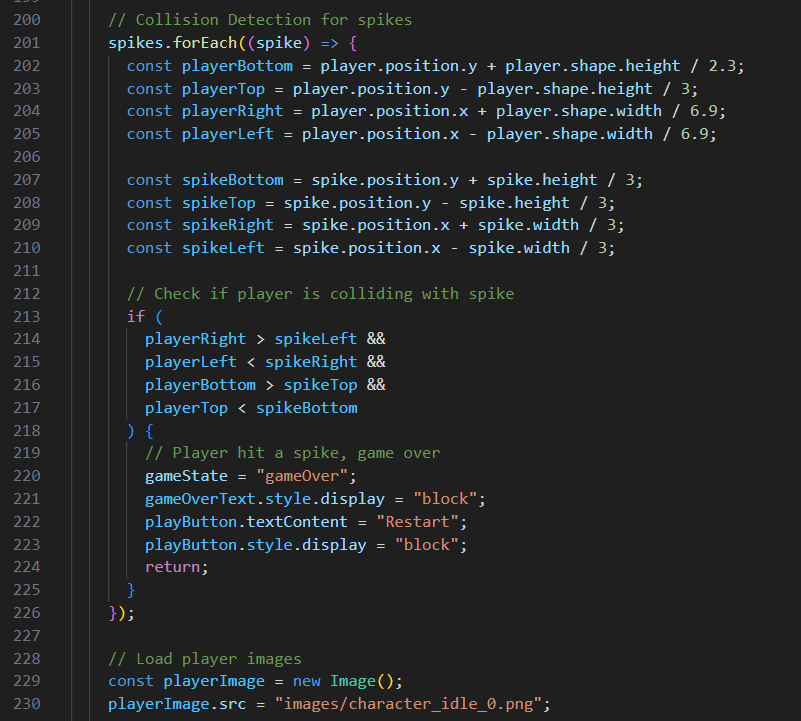

## Reflektioner

### Workshop

Efter workshoppen där vi kollade på varandras kod (som var både roligt och skrämmande) så har jag gjort ändringar i min project. I Labaoration 2 hade jag hela min kod
i en enda fil. Filen blev längre än väntat så jag styckade upp det efter rekommendationen från klasskamraten som analyserade min kod. Har även tillagt gitignore direkt 
för att slippa skicka upp node_modules.

### Clean Code 

#### Kapitel 2: Meaningful Names
Genom att tillämpa principerna från kapitel 2 har jag förbättrat läsbarheten i min kod genom att använda meningsfulla och beskrivande namn. Till exempel använder jag PhysicsWorld för att tydligt beskriva spelets fysikmotor, vilket gör det enkelt att förstå dess roll utan att behöva granska implementationen. 
Variabelnamn som till exempel gameOverText och playButton är intuitiva och förklarar direkt deras funktion inom spelet. Detta har minskat behovet av kommentarer och gjort koden mer självförklarande. Dessutom har jag undvikit förkortningar och vilseledande namn, vilket ökar kodens underhållbarhet.

#### Kapitel 3: Functions
Kapitel 3 har varit avgörande för hur jag strukturerade mina funktioner. Jag har strävat efter att hålla funktioner små och att de skulle fokusera på en enda uppgift, vilket ses i funktioner som initializeGame och gameLoop. Genom att följa Command-Query Separation har jag säkerställt att funktioner antingen returnerar ett värde eller utför en åtgärd, men inte båda samtidigt. Detta har gjort funktioner mer förutsägbara och lättare att testa. Dessutom har jag undvikit output-argument och istället använt undantag för felhantering, vilket förbättrar kodens robusthet.

#### Kapitel 4: Comments
Jag har tillämpat kapitlets råd genom att minimera användningen av kommentarer och istället fokusera på att skriva självdokumenterande kod. Till exempel beskriver funktionerna och klasserna tydligt deras syfte och beteende, vilket gör att man inte behöver lägga till förklarande kommentarer. När komplex logik kräver förtydliganden har jag refaktorerat koden för att göra den mer intuitiv. Detta har resulterat i en renare kodbas där kommentarer endast används för att klargöra avsikter snarare än att beskriva vad koden gör.

#### Kapitel 5: Formatting
Genom att följa kapitel 5 har jag försökt skriva koden som är välformaterad och lättläst. Jag har använt konsekvent indentering och horisontell uppdelning för att tydligt separera olika kodblock. Till exempel är funktioner och klasser organiserade med tydliga mellanrum och indragningar, vilket förbättrar den visuella strukturen. Jag har också hållit raderna korta och metoder vertikalt små, vilket underlättar för utvecklare att snabbt förstå koden utan att behöva scrolla mycket. Jag har använt mig av prettier i denna project (första gången) och tyckte den va väldigt bra.

#### Kapitel 6: Objects and Data Structures
Kapitel 6 har hjälpt mig att skilja mellan objekt och datastrukturer i min kod. Jag har använt objektorienterad design för att kapsla in spelobjekt och deras beteenden, vilket gör det enklare att lägga till exempel nya typer av hinder och fiender utan att behöva ändra befintlig kod. Till exempel representerar `RigidBody` objekt som hanterar fysikinteraktioner, medan data som spikes hanteras som separata strukturer. Detta har minskat komplexiteten och förbättrat kodens underhållbarhet genom att hålla ansvarsområdena tydliga och separata. Genom att undvika hybrider mellan objekt och datastrukturer har jag skapat en mer ren och modulär kodbas. 

#### Kapitel 7: Error Handling

Principerna från kapitel 7 har förbättrat min felhantering genom att använda undantag istället för felkoder. I min kod hanterar jag spelövergångar till game over-stadiet genom att ändra `gameState` och visa relevanta element, vilket är en form av undantagshantering. Jag har också säkerställt att felhanteringen är separerad från huvudlogiken, vilket gör att min spelloop förblir ren och fokuserad. Genom att undvika att returnera null eller använda felkoder har jag minskat risken för runtime-fel och gjort koden mer robust. Detta har gjort min kod mer lättförståelig och enklare att felsöka, eftersom felhanteringen inte blandas med spelmekaniken.

#### Kapitel 8: Boundaries

Genom att tillämpa kapitel 8 har jag hållit gränserna mellan min kod och externa system väl definierade. Min fysikmodul, som består av klasser som `Vector2D`, `RigidBody` och `PhysicsWorld`, är isolerad från resten av spelet, vilket gör det enkelt att byta ut eller uppdatera dessa komponenter utan att påverka den övergripande spelkoden. Jag har också designat mina klasser och funktioner för att vara flexibla och lättanpassade, vilket minimerar beroenden och gör integrationen av nya funktioner smidigare. Detta har förbättrat min kodens modularitet och underhållbarhet.
I `platformer.js` används `PhysicsWorld` för att hantera fysiken utan att direkt påverka huvudspelloopen. Genom att använda denna struktur håller jag gränsen mellan olika delar av koden tydlig, vilket gör det enklare att byta ut fysiksystemet eller göra justeringar i det utan att behöva ändra andra delar av koden. Exempel på detta är hur `PhysicsWorld` initieras och används i `initializeGame`

#### Kapitel 9: Unit Tests

Kapitel 9 har betonat vikten av enhetstester, vilket jag har implementerat i mitt projekt. Jag har skrivit enhetstester för kritiska funktioner som `initializeGame` och `gameLoop` i `tests/physics.test.js`, vilket har hjälpt mig att säkerställa att varje del fungerar korrekt. Enhetstesterna följer **F.I.R.S.T.**-principerna genom att vara snabba, oberoende, repetabla, självvaliderande och timely . Till exempel testar jag att `Vector2D`-klassen korrekt utför addition, subtraktion, och normalisering, vilket säkerställer att fysikberäkningarna är korrekta. Dessutom har jag manuellt testat spelet via webbgränssnittet för att verifiera spelbarhet och användargränssnitt, vilket kompletterar de automatiserade testerna och ger en helhetsbild av spelets funktionalitet. Detta har inte bara förbättrat min kodkvalitet utan också gjort det enklare att refaktorisera och utöka spelet utan att introducera nya buggar.

#### Kapitel 10: Classes

Principerna från kapitel 10 har hjälpt mig att designa mina klasser med en enda ansvarighet, vilket följer **Single Responsibility Principle (SRP)**. Till exempel har klassen `PhysicsWorld` endast ansvar för att hantera fysikens dynamik, medan `RigidBody` fokuserar på att representera fysiska objekt. Genom att föredra komposition över arv har jag skapat flexibla och återanvändbara komponenter, vilket gör det lättare att utöka spelet med nya funktioner utan att behöva modifiera befintliga klasser. Detta har förbättrat kodens flexibilitet och minskat risken för kaskadförändringar, vilket gör min kodbas mer robust och lätt att underhålla.

#### Kapitel 11: Systems

Kapitel 11 har inspirerat mig att designa spelets system som rena och modulära komponenter. Jag har separerat ansvar till distinkta klasser och moduler, vilket gör det enklare att hantera komplexiteten. Man kan säga att man har uppfyllt konceptet med Plain Old Java Objects (POJOs) Till exempel hanterar `PhysicsWorld` all fysikrelaterad logik, medan `platformer.js` ansvarar för spelloop och rendering. Genom att använda dependency injection har jag isolerat beroenden mellan olika delar av spelet, vilket förbättrar testbarheten och underlättar framtida utvidgningar. Detta har resulterat i en mer organiserad och hanterbar kodbas, där varje system är tydligt avgränsat och lätt att arbeta med individuellt.

