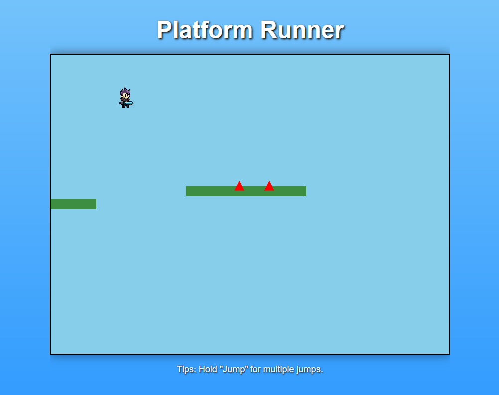

# Test Report for Physics Simulation Module

## Introduction

This test report documents the testing of the Physics Simulation Module. The tests were conducted using the Jest testing framework and are located in the `physics.test.js` file. 
Each test case is designed to verify the correctness of the module's functionalities. Below, each test case is detailed with information on what was tested, how it was performed, and the results.

## Game Test

Game has been tested through web interface and the logic for Jump, Left and Right movement works as intended. 
The Game Over on impact with spikes or falling down is also working as intended. 
Here is the jumping

And also dying

Rest of the tests are for the module itself and its the same as from L2. I have made my L2 into several files and had to redo how the tests are being done.

## Test Cases

### 1. Vector Addition

- **What Was Tested**: The `add` method of the `Vector2D` class.
- **How It Was Tested**:
  - Created two vectors: `v1` with coordinates `(1, 2)` and `v2` with coordinates `(3, 4)`.
  - Called `v1.add(v2)` to get the result.
  - Expected the result to be a vector with coordinates `(4, 6)`.
- **Test Result**: **Passed**

### 2. Circle Contains Point

- **What Was Tested**: The `containsPoint` method of the `Circle` class.
- **How It Was Tested**:
  - Created a circle with a radius of `10`.
  - Defined a position for the circle at `(0, 0)`.
  - Tested with two points:
    - Inside Point: `(5, 5)`
    - Outside Point: `(15, 15)`
  - Called `circle.containsPoint(point, position)` for both points.
  - Expected:
    - Inside Point to return `true`.
    - Outside Point to return `false`.
- **Test Result**: **Passed**

### 3. Vector Subtraction

- **What Was Tested**: The `subtract` method of the `Vector2D` class.
- **How It Was Tested**:
  - Created two vectors: `v1` with coordinates `(5, 7)` and `v2` with coordinates `(2, 3)`.
  - Called `v1.subtract(v2)` to get the result.
  - Expected the result to be a vector with coordinates `(3, 4)`.
- **Test Result**: **Passed**

### 4. Vector Magnitude

- **What Was Tested**: The `magnitude` method of the `Vector2D` class.
- **How It Was Tested**:
  - Created a vector `v` with coordinates `(3, 4)`.
  - Called `v.magnitude()` to calculate the magnitude.
  - Expected the magnitude to be `5`.
- **Test Result**: **Passed**

### 5. Vector Normalization

- **What Was Tested**: The `normalize` method of the `Vector2D` class.
- **How It Was Tested**:
  - Created a vector `v` with coordinates `(3, 4)`.
  - Called `v.normalize()` to get the normalized vector.
  - Expected the normalized vector to have coordinates approximately `(0.6, 0.8)`.
  - Used `toBeCloseTo` for floating-point comparison.
- **Test Result**: **Passed**

### 6. Rectangle Contains Point

- **What Was Tested**: The `containsPoint` method of the `Rectangle` class.
- **How It Was Tested**:
  - Created a rectangle with width `20` and height `10`.
  - Defined a position for the rectangle at `(0, 0)`.
  - Tested with two points:
    - Inside Point: `(5, 0)`
    - Outside Point: `(15, 0)`
  - Called `rectangle.containsPoint(point, position)` for both points.
  - Expected:
    - Inside Point to return `true`.
    - Outside Point to return `false`.
- **Test Result**: **Passed**

### 7. Polygon Contains Point

- **What Was Tested**: The `containsPoint` method of the `Polygon` class.
- **How It Was Tested**:
  - Created a polygon with vertices:
    - `(-5, -5)`, `(5, -5)`, `(5, 5)`, `(-5, 5)`
  - Defined a position for the polygon at `(0, 0)`.
  - Tested with two points:
    - Inside Point: `(0, 0)`
    - Outside Point: `(10, 10)`
  - Called `polygon.containsPoint(point, position)` for both points.
  - Expected:
    - Inside Point to return `true`.
    - Outside Point to return `false`.
- **Test Result**: **Passed**

### 8. RigidBody Integration Updates Position and Velocity

- **What Was Tested**: The `integrate` method of the `RigidBody` class.
- **How It Was Tested**:
  - Created a `RigidBody` with:
    - Initial position `(0, 0)`
    - Initial velocity `(1, 0)`
    - Mass `1`
    - Shape: Circle with radius `5`
  - Applied a force of `(1, 0)` to the body.
  - Called `body.integrate(1)` to integrate over `1` second.
  - Expected:
    - New velocity to be `(2, 0)`
    - New position to be `(2, 0)`
- **Test Result**: **Passed**

### 9. PhysicsWorld Step Updates Body Positions

- **What Was Tested**: The `step` method of the `PhysicsWorld` class.
- **How It Was Tested**:
  - Created a `PhysicsWorld` instance.
  - Created a `RigidBody` with:
    - Initial position `(0, 0)`
    - Initial velocity `(1, 0)`
    - Mass `1`
    - Shape: Circle with radius `5`
  - Added the body to the world.
  - Called `world.step(1)` to step the simulation by `1` second.
  - Expected:
    - New position to be approximately `(1, 9.8)` due to gravity acting in the positive y-direction.
    - Used `toBeCloseTo` for the y-coordinate to account for floating-point precision.
- **Test Result**: **Passed**

### 10. Collision Between Two Circles

- **What Was Tested**: Collision detection and resolution between two `RigidBody` instances with circular shapes.
- **How It Was Tested**:
  - Created a `PhysicsWorld` instance.
  - Created two `RigidBody` instances:
    - **Circle A**:
      - Position `(0, 0)`
      - Velocity `(1, 0)`
      - Mass `1`
      - Shape: Circle with radius `10`
      - Restitution `1` (perfectly elastic collision)
    - **Circle B**:
      - Position `(15, 0)`
      - Velocity `(-1, 0)`
      - Mass `1`
      - Shape: Circle with radius `10`
      - Restitution `1`
  - Added both bodies to the world.
  - Called `world.step(1)` to step the simulation by `1` second, causing a collision.
  - Expected:
    - After collision, velocities of the circles should have swapped signs:
      - **Circle A**: Velocity `(-1, 0)`
      - **Circle B**: Velocity `(1, 0)`
- **Test Result**: **Passed**

### 11. RigidBody Emits Collision Event

- **What Was Tested**: Event emission upon collision in the `RigidBody` class.
- **How It Was Tested**:
  - Created a `PhysicsWorld` instance.
  - Created two `RigidBody` instances:
    - **Circle A**:
      - Position `(0, 0)`
      - Velocity `(1, 0)`
      - Mass `1`
      - Shape: Circle with radius `10`
    - **Circle B**:
      - Position `(15, 0)`
      - Velocity `(-1, 0)`
      - Mass `1`
      - Shape: Circle with radius `10`
  - Added an event listener to **Circle A** for the `'collision'` event:
    - Set a flag `collisionOccurred` to `true` when the event handler is called.
  - Added both bodies to the world.
  - Called `world.step(1)` to step the simulation by `1` second.
  - Expected:
    - `collisionOccurred` to be `true`.
    - Event data to include the other body involved in the collision (**Circle B**).
- **Test Result**: **Passed**

## Test Results Summary

| Test Case                                   | Test Result |
|---------------------------------------------|-------------|
| **1. Vector Addition**                      | Passed      |
| **2. Circle Contains Point**                | Passed      |
| **3. Vector Subtraction**                   | Passed      |
| **4. Vector Magnitude**                     | Passed      |
| **5. Vector Normalization**                 | Passed      |
| **6. Rectangle Contains Point**             | Passed      |
| **7. Polygon Contains Point**               | Passed      |
| **8. RigidBody Integration**                | Passed      |
| **9. PhysicsWorld Step Updates Positions**  | Passed      |
| **10. Collision Between Two Circles**       | Passed      |
| **11. RigidBody Emits Collision Event**     | Passed      |

## Conclusion

All tests passed successfully. The module functions correctly in all tested scenarios, verifying that the core functionalities of vector operations, shape methods, rigid body dynamics, collision detection and resolution, and event handling are working as intended.

## Instructions for Reproducing the Tests

To reproduce these tests, follow these steps:

1. **Set Up the Environment**:
   - Ensure that Node.js and npm are installed on your system.
   - Clone or download the project repository containing the `physics.js` module and the `test` directory.

2. **Install Dependencies**:
   - Navigate to the project directory in your terminal.
   - Initialize npm if not already done:
     
     npm init -y
     
   - Install Jest as a development dependency:
     
     npm install --save-dev jest
    

3. **Verify Test Files**:
   - Ensure that the `physics.test.js` file is located in the `test` directory.
   - Confirm that the test file imports the module correctly and that all test cases are included.

4. **Run the Tests**:
   - Add the following script to your `package.json` file under `"scripts"`:
    
     "test": "jest"
    
   - Run the tests using the command:
    
     npm test
    
   - Jest will execute all the test cases and display the results in the terminal.

5. **Analyze the Output**:
   - Review the test results output by Jest to confirm that all tests have passed.
   - If any tests fail, the output will include details to help identify and fix issues.

